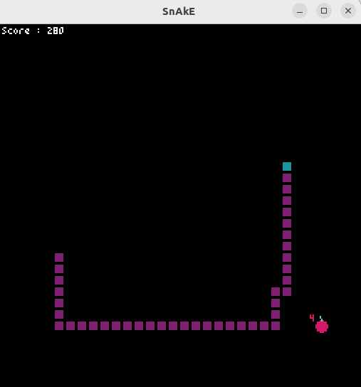
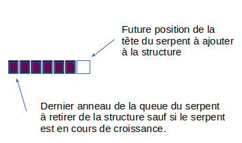

# SnAkE

Le [snake](https://fr.wikipedia.org/wiki/Snake_(genre_de_jeu_vid%C3%A9o)) est un jeu créé en 1978 pour la borne d'arcade Telmac ci-dessous :


Il a connu de très nombreuses versions dont celle des premiers téléphones portables nokia qui lui a donné un regain de popularité en 1997 en tant qu'un des tous premiers jeux sur téléphone mobile.

Le concept du jeu est le suivant :

* un "serpent" consitué de quelques anneaux est déplacé par le joueur dans les quatre directions haut, bas, droite et gauche. Le serpent ne peut pas revenir sur lui même;
* Si le serpent se mord lui même ou percute le bord de l'écran, la partie est terminée;
* Une pomme associée à une valeur entre 2 et 9 apparait aléatoirement sur l'écran (mais pas sur le serpent). Si le serpent parvient à la _manger_, il s'allonge d'autant d'anneaux que la valeur en marquant un certain nombre de points et une nouvelle pomme apparait.

Voici un rendu final possible :



## Pyxel

Nous allons utiliser le module [_pyxel_](https://pypi.org/project/pyxel/).

* La zone de jeu fera 256 px sur 256px;
* les anneaux et la tête du serpent sont représentés par le carré de couleurs de 8px sur 8px ci-dessous. Ils sont repérés par les coordonnées du coin en haut à gauche.

  
* Une pomme sera représentée par un disque de rayon 4px et **d'une couleur différente de celle du serpent**. Sa valeur sera affichée à côté d'elle dans une **une couleur différente de celle du serpent et de la pomme.**

Voici, ci-dessous, la structure du jeu. Sauvegardez la sous le nom _snake.py_.

```python
import pyxel


def gerer_clavier():
    '''
    gestions du clavier
    '''

def dessiner():
    '''
    la partie dédié aux graphismes
    '''
    pyxel.cls(0)

                     

def calculer():
	'''
	La partie dédiée aux calculs
	'''
          
          
     
                     
pyxel.init(256, 256, 'SnAkE')
#Ici on déclarera les instances de classes dont on a besoin

#on lance le jeu
pyxel.run(calculer, dessiner)
      


```

## La classe Snake

Créez un fichier _classe_snake.py_ où vous coderez cette classe.

### Attributs et structures de données

La classe `Snake` utilisera plusieurs attributs :

* _x_, _y_ pour les coordonnées de la tête du serpent. Ce sont obligatoirement des multiples de 8. Initialement, _x_ = 24 et _y_ = 32.
* _dx_ et _dy_ qui prennent respectivement pour valeur initiale 8 et 0 serviront au déplacement du serpent.
* _grandir_ qui vaut initialement 10 correspondra au nombre d'anneaux dont le serpent est en train de grandir;
* _perdu_ vaut _False_ au départ et prendra la valeur _True_ lorsque la partie sera terminée;
* _score_, initialement à 0, sera... le score.

Il manque un attribut : celui qui stockera la position de chaque anneau du serpent grâce aux coordonnées du coin en haut à gauche de chaque anneau.

Réfléchissons à la meilleure structure de données possible :

* lorsque la tête se déplace :
  * le serpent gagne un nouvel anneau : la nouvelle position de la tête su serpent
  * si _grandir_ vaut 0, le dernier anneau du serpent disparait sinon _grandir_ diminue de 1.



> * Quelle est la structure à choisir (un indice c'est une pile ou une file) ?
> * A quel attributs de la structure la tête et la queue du serpent correspondent-ils ?
> * Ajouter l'attribut _anneaux_ qui correppond à la structure choisie et ajoutez-y les coordonnées de la tête du serpent, seul anneau présent au départ.

### Méthodes

Nous aurons besoin des méthodes ci-dessous :

* `afficher` : affiche les anneaux du serpent( Attention l'attribut _anneaux_  ne doit pas être modifié par l'affichage !) et le score en haut à gauche de l'écran.
* `deplacer` :
  * modifie les attributs _x_ et _y_ en leur ajoutant respectivement _dx_ et _dy_.
  * le couple de coordonnées (_x_, _y_) est ajouté aux _anneaux_.
  * si _grandir_ vaut 0 alors on retire le dernier anneau du serpent de _anneaux_ sinon _grandir_ diminue de 1
* `mord_pomme` renvoie `True` si il y a une pomme en (_x_, _y_) et `False` sinon.
* `est_perdu` modifie l'attribut _perdu_ si le serpent se percute lui même ou touche le bord de l'écran. _perdu_ prend alors la valeur `True`. A la fin de la méthode, la valeur de l'attribut _perdu_ est renvoyé.
* `fin_de_partie` : si la structure _anneaux_ n'est pas vide, on lui enlève son dernier anneau.
* un accesseur et un mutateur pour les attributs _score_, _dx_, _dy_ et _grandir_.

_Remarques_ à lire attentivement_ :

* N'oubliez pas d'importer _pyxel_;
* `mord_pomme` et `est_perdu` utilisera l'instruction `pyxel.pget(abscisse, ordonnee)` qui renvoie la couleur du pixel situé aux coordonnées précisées. Ainsi, onpeut savoir si la tête touche une pomme ou un anneau (c'est pour cela qu'il est stipulé plus haut que les anneaux et la pomme ne doivent pas être de la même couleur !). Testez bien le centre du carré et pas son coin en haut à gauche.
* Dans _snake.py_, au fur et à mesure du développement de votre classe :

  * importez _classe_snake_;
  * après avoir défini la fenêtre graphique, déclarez une instance de la classe Snake.
  * Dans `dessiner` :
    * afficher le serpent dès que la méthode correspondante est codée.
    * si la partie est perdue, affichez _"Game Over"_ dès que la méthode correspondante est prête.
  * Dans `calculer`  :
    * Si la partie n'est pas perdue,  déplacer le serpent dès que les méthodes correspondantes sont prêtes  (pour l'instant, il va tout droit).
    * si la partie est perdue, appelez `fin_de_partie` .

## La classe Pomme

Créez un fichier _classe_pomme.py_ dans lequel vous coderez cette classe.

### Attributs

Une pomme n'a que 3 attributs :

* _x_ initialement à 128 : son abscisse de départ. _x_ est toujours multiple de 8.
* _y_ initialement à 32 : son ordonnée de départ. _y_ est toujours multiple de 8.
* valeur initialement à 9 : sa valeur de départ. La valeur sera toujours comprise entre 2 et 9.

_Remarque_ :

* les attributs _x_ et _y_ ne correspondent pas au centre de la pomme mais au coin en haut à gauche du carré du 8px sur 8px qui la contient.

### Méthodes

Nous aurons besoin des méthodes suivantes :

* `afficher` dessine la pomme sous la forme d'un cercle de centre (_x_ +4, _y_ +4) et de rayon 4. Sa couleur est importante car elle intervient dans la fonction `mord_pomme` de la classe `Snake`.
* `deplacer`: place la pomme à de nouvelles coordonnées, multiples de 8, de façon à ce qu'elle ne soit pas sur un anneau. Pour cela, on utilisera à nouveau l'instruction  `pyxel.pget(abscisse, ordonnee)` .
* un accesseur pour l'attribut _valeur_.

Au fur et à mesure du développement de votre classe, dans le programme _snake.py_ :

* ;importer _classe_pomme_
* définissez une instance de la classe `Pomme` sous l'instance de la classe  `Snake`;
* dans `dessiner`, afficher la pomme;
* dans `calculer`, si la partie n'est pas finie :
  * si le serpent mord la pomme :
    * _grandir_ augmente de la _valeur_ de la pomme.
    * la pomme est déplacée.

## Snake.py

Il reste à diriger le serpent.

pour cela, coder la fonction `gerer_clavier` qui :

* teste la direction choisie par le joueur en utilisant `pyxel.btn(touche)` où _touche_ peut prendre les valeurs `pyxel.KEY_RIGHT`, `pyxel.KEY_LEFT`, `pyxel.KEY_UP` et `pyxel.KEY_DOWN`.
* Si la direction est possible (le serpent ne peut pas reculer) alors les attributs _dx_ et _dy_ du serpent sont modifiés en conséquences (ils peuvent valoir ±8 uniquement) via leur mutateur.

N'oubliez pas d'appeler `gerer_clavier` dans la fonction `calculer`.

---

Par Mieszczak Christophe Licence CC BY SA

sources :

* [borne d&#39;arcane snake - wikipedia](https://commons.wikimedia.org/wiki/File:Matopeli_telmac_1800.JPG)
* rendu attendu : production personnel
